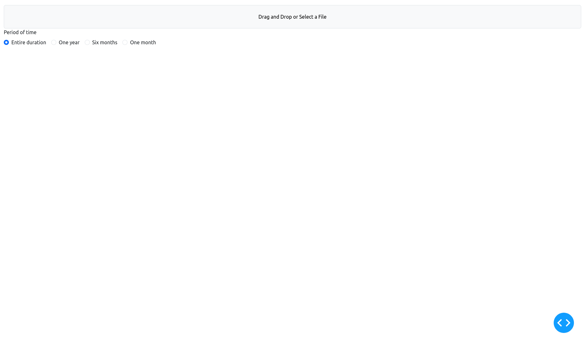
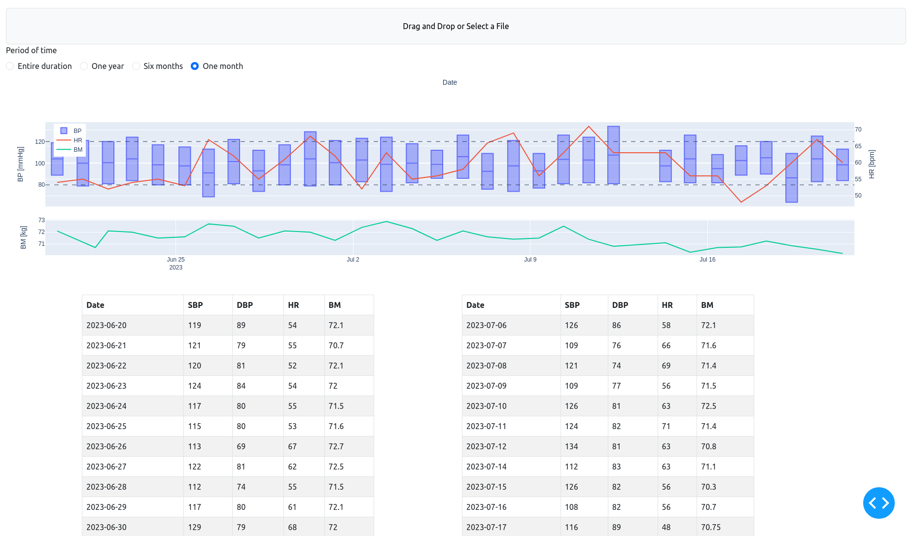

# apple-health-dashboard

Show iPhone Health app records in a graph and a table.

## Motivation

For practice of [Plotly Dash](https://dash.plotly.com/) and monitoring my
vital data for my health ;-)

## Installation

```console
$ python3 -m venv .venv
$ source .venv/bin/activate
$ pip3 install apple_health_dashboard-0.1.0-py3-none-any.whl
```

Then make sure to create a flask instance directory where **your health data
is stored**.
In case where you install this package in virtual environment:

```console
$ mkdir -p .venv/var/apple_health_dashboard.app-instance
```

For more details, please refer
[here](https://flask.palletsprojects.com/config/#instance-folders).

## Usage

### Run the app

Simply (run with [Flask](https://flask.palletsprojects.com/) debug server):

```console
$ python3 -m apple_health_dashboard
Dash is running on http://127.0.0.1:8050/

 * Serving Flask app 'apple_health_dashboard.app'
 * Debug mode: on
```

With [Gunicorn](https://gunicorn.org/):

```console
$ gunicorn 'apple_health_dashboard:server'
[2023-09-30 21:26:26 +0900] [8739] [INFO] Starting gunicorn 21.2.0
[2023-09-30 21:26:26 +0900] [8739] [INFO] Listening at: http://127.0.0.1:8000 (8739)
[2023-09-30 21:26:26 +0900] [8739] [INFO] Using worker: sync
[2023-09-30 21:26:26 +0900] [8740] [INFO] Booting worker with pid: 8740
```



### Upload a health data

Pass the app a health data (a zip file), which is exported by the iPhone
health app, then a graph and a table for the data are shown.

